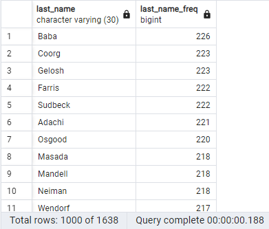

**SQL CHALLENGE**

**(1) Project Overview and Purpose:**

This is exercise relates to Human Resources research regarding people whom a company employed during the 1980s and 1990s. Only historical information remains and the research is design the tables to hold the data from the source files, import them into a SQL database, and then answer certain questions about the data.

**(2) Dataset Description:**

The historical HR files are comprised of 6 .csv files:

(a) "departments.csv" contains Department Numbers and Department Names

(b) "titles.csv" contains Title Identifiers and Titles

(c) "employees.csv" contains Employee Numbers; Employee Title Identifiers; Employee Birth Dates; Employee First and Last Names; Employee Genders; and Employee Hire Dates

(d) "dept_manager.csv" contains Department Numbers and Employee Numbers for the respective managers

(e) "dept_emp.csv" contains Employee Numbers and their Department Numbers

(f) "emp_no.csv" contains Employee Numbers and their salaries

**(3) Data Cleaning and Preprocessing:**

The information stored in the above six .csv files is complete, as not missing or partial data is present.

Table schema were created for each of the six .csv files (including adding any primary and/or foreign keys). Each .csv file was then imported into SQL. These steps are denoted in the SQL code found in the file "m9c_table_build_sql_roop_31-may-2024.sql".

**(4) Data Visualization Techniques:**

An Entity Relationship Diagram [ERD] was generated based on the information found in the 6 tables using QuickDBD [https://www.quickdatabasediagrams.com/].

Tables were generated, but for display purposes, only show the first several rows.

**(5) Results and Analysis:**

The following visualization and tables were generated for this exercise-

(a) ERD:

(b) List with employee number, last name, first name, sex, and salary:

(c) List with the first name, last name, and hire date for the employees who were hired in 1986:

(d) List with the manager of each department along with their department number, department name, employee number, last name, and first name:

(e) List with the department number for each employee along with that employee’s employee number, last name, first name, and department name:

(f) List with first name, last name, and sex of each employee whose first name is Hercules and whose last name begins with the letter B:

(g) List with each employee in the Sales department, including their employee number, last name, and first name:

(h) List with each employee in the Sales and Development departments, including their employee number, last name, first name, and department name:

(i) List the frequency counts, in descending order, of all the employee last names (that is, how many employees share each last name):

**(6) Ethical Considerations:**

The files contain sensitive information (i.e., date of birth) that could be used in combination with first and last name to be problematic (e.g., identify theft). This information should be stored securely.

Other information (i.e., salary) is sensitive as well

Dissemination of this information should be minimized and limited to only those that have corporate approval to use; analyze; and/or store the sensitive data.

**(7) Instructions for Interacting with the Project:**

Code is located in two files within the Main folder, namely "m9c_table_build_sql_roop_31-may-2024.sql" and "m9c_data_analysis_roop_31-may-2024.sql".

The ERD is located in the Main folder as "Module_9_ERD_Roop.png".

The .csv files are located in the **Employee_SQL** folder.

The example tables are located in the **Tables** folder.

**(8) Citations:**

Several questions asked of Xpert Learning Assistant on the following topics:

(a) syntax checks on code written by student

(b) advice on correctly saving and retrieving .sql files

(c) how to find dates from a list within a certain range of dates instead of AND or less than (<) / greater than (>) attempts
